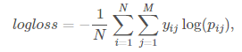

# Machine Learning Engineer Nanodegree
## Capstone Proposal-Distracted Driver Detection
Yuxiang Jiang  
May 8th, 2017

## Proposal
Distracted Driver Detection.

### Domain Background

We've all been there: a light turns green and the car in front of you doesn't budge. Or, a previously unremarkable vehicle suddenly slows and starts swerving from side-to-side.

When you pass the offending driver, what do you expect to see? You certainly aren't surprised when you spot a driver who is texting, seemingly enraptured by social media, or in a lively hand-held conversation on their phone.

According to the CDC motor vehicle safety division, one in five car accidents is caused by a distracted driver. Sadly, this translates to 425,000 people injured and 3,000 people killed by distracted driving every year.

State Farm hopes to improve these alarming statistics, and better insure their customers, by testing whether dashboard cameras can automatically detect drivers engaging in distracted behaviors. Given a dataset of 2D dashboard camera images, State Farm is challenging Kagglers to classify each driver's behavior.

### Problem Statement

We are given driver images, each taken in a car with a driver doing something in the car(texting, eating, talking on the phone, makeup, reaching behind, etc). Our goal is to predict the likelihood of what the driver is doing in each picture.

The 10 classes to predict are:
* c0: safe driving
* c1: texting - right
* c2: talking on the phone - right
* c3: texting - left
* c4: talking on the phone - left
* c5: operating the radio
* c6: drinking
* c7: reaching behind
* c8: hair and makeup
* c9: talking to passenger

To solve this problem, I will build a Deep Nerual Network, or use the popular net structrue such as ResNet. 

### Datasets and Inputs

The Datasets are collected by "State Farm", you can download the data from the website:https://www.kaggle.com/c/state-farm-distracted-driver-detection/data

#### File descriptions

* imgs.zip - zipped folder of all (train/test) images
* sample_submission.csv - a sample submission file in the correct format
* driver_imgs_list.csv - a list of training images, their subject (driver) id, and class id

### Solution Statement

Deep Residual Learning is a protential solution for this question. ResNet is developed by using the residual learning framework. As our data have ten different labels, and the contents of pictures are very complicated, our net must be deep enough to distinguish the small features which can represent the class very well. 
The deep convolutional neural networks have a problem calls "degradation problem": with the network depth increasing, accuracy gets saturated and then degrades rapidly. Adding more layers to a suitable deep model leads to higher training error. The ResNet can ease the training of the training of the networks that are substantially deeper than those used previously.

### Benchmark Model

The reference ResNet framwork are below:

We can use this framework to build a very deep neural network.

### Evaluation Metrics

Submissions are evaluated using the multi-class logarithmic loss. Each image has been labeled with one true class. For each image, you must submit a set of predicted probabilities oneforeveryimageoneforeveryimage. The formula is then,

where N is the number of images in the test set, M is the number of image class labels,  \\loglog is the natural logarithm, \\yijyij is 1 if observation \\ii belongs to class \\jj and 0 otherwise, and \\pijpij is the predicted probability that observation \\ii belongs to class \\jj.

The submitted probabilities for a given image are not required to sum to one because they are rescaled prior to being scored eachrowisdividedbytherowsumeachrowisdividedbytherowsum. In order to avoid the extremes of the log function, predicted probabilities are replaced with \\max(min(p,1−10−15max(min(p,1−10−15,10^{-15})\\).

#### Submission File

You must submit a csv file with the image file name, and a probability for each class.

The 10 classes to predict are:

c0: normal driving
c1: texting - right
c2: talking on the phone - right
c3: texting - left
c4: talking on the phone - left
c5: operating the radio
c6: drinking
c7: reaching behind
c8: hair and makeup
c9: talking to passenger

The order of the rows does not matter. The file must have a header and should look like the following:

img,c0,c1,c2,c3,c4,c5,c6,c7,c8,c9
img_0.jpg,1,0,0,0,0,...,0
img_1.jpg,0.3,0.1,0.6,0,...,0
...

### Project Design

Workflow

* Load data
* visualize data
* split data into training and testing sets
* design the train model
* visualize the model
* train the model
* calculate the accuracy
* sample predict
* save model

-----------

**Before submitting your proposal, ask yourself. . .**

- Does the proposal you have written follow a well-organized structure similar to that of the project template?
- Is each section (particularly **Solution Statement** and **Project Design**) written in a clear, concise and specific fashion? Are there any ambiguous terms or phrases that need clarification?
- Would the intended audience of your project be able to understand your proposal?
- Have you properly proofread your proposal to assure there are minimal grammatical and spelling mistakes?
- Are all the resources used for this project correctly cited and referenced?
